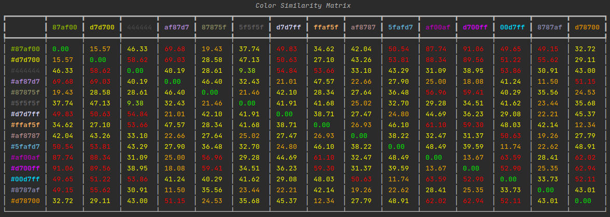
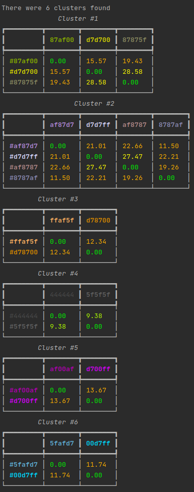

# colordiff
A toy project to test out clustering using the visual similarity of colors

The point of this project is to be able to test out different clustering algorithms and parameters using the similarity (or distance between) two colors.

## Color Choices
To keep things simple we're randomly choosing some [terminal colors](https://jonasjacek.github.io/colors/).

## Color Space
The colors are stored in RGB, in order to be able to compare them we convert them to the [CIELAB color space](https://en.wikipedia.org/wiki/CIELAB_color_space)

## Color Difference
Once colors are converted we can compare their similarity using the [CIEDE2000 color difference formula.](https://en.wikipedia.org/wiki/Color_difference#CIEDE2000)

The color difference (aka Delta-E) seems to have a range of 0-100+ where 1.0 is the smallest color difference the human eye can see.

Unfortunately I could not find any sources explaining this more besides [this](http://zschuessler.github.io/DeltaE/learn/) and [this](http://www.colorwiki.com/wiki/Delta_E:_The_Color_Difference)
which has the following chart:

| Delta-E | Description                            |
|---------|----------------------------------------|
| <= 1.0  | Not perceptible by human eyes.         |
| 1 - 2   | Perceptible through close observation. |
| 2 - 10  | Perceptible at a glance.               |
| 11 - 49 | Colors are more similar than opposite  |
| 100     | Colors are exact opposite              |

## Clustering
Currently, the algorithms below are implemented.

Each one will print out the full similarity matrix.

If clusters are found, a smaller similarity matrix for each cluster will be output.

### [DBSCAN](https://scikit-learn.org/stable/modules/generated/sklearn.cluster.DBSCAN.html#sklearn.cluster.DBSCAN)
This can be tuned with the `eps` (epsilon) parameter.

### [AgglomerativeClustering](https://scikit-learn.org/stable/modules/generated/sklearn.cluster.AgglomerativeClustering.html#sklearn.cluster.AgglomerativeClustering)
This can be tuned with the `linkage` and `distance_threshold` parameters.
